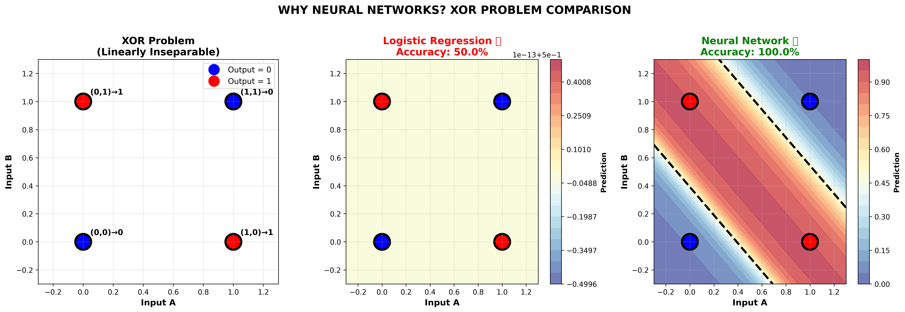
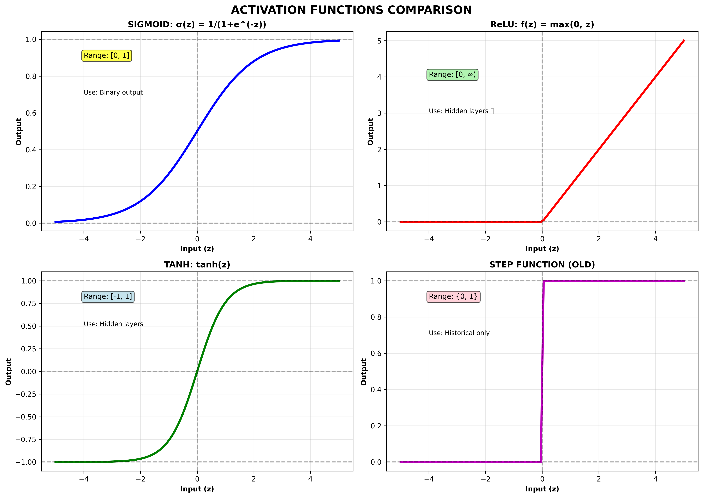
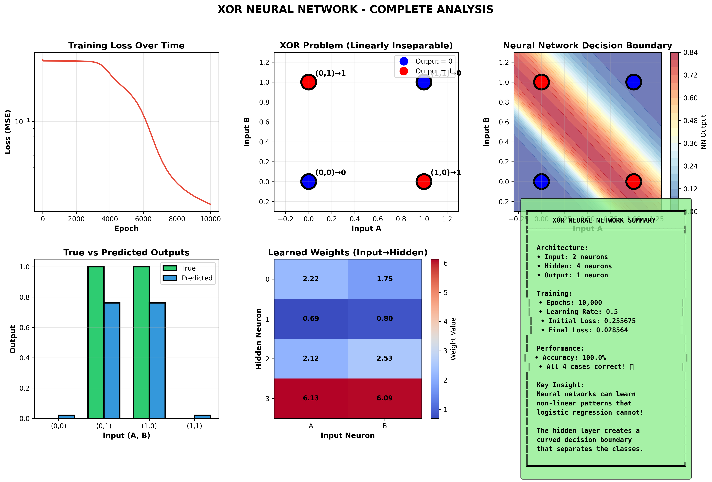

# Day 15: Neural Network Foundations

## 🎯 Today's Achievement (3 Hours)

Built a neural network **from scratch** using only NumPy, solved the XOR problem (impossible for linear models), and understood the fundamentals of deep learning.

---

## 📚 What I Learned

### 1. Why Neural Networks?

**The XOR Problem:**
Input A │ Input B │ Output (XOR)
────────┼─────────┼─────────────
0    │    0    │      0
0    │    1    │      1
1    │    0    │      1
1    │    1    │      0

**Visualization:**
B
1 │  🔴(0,1)→1    🔵(1,1)→0
│
0 │  🔵(0,0)→0    🔴(1,0)→1
└──────────────────── A
0             1

**Problem:** Cannot separate with a **straight line**!  
**Solution:** Neural networks learn **curved** decision boundaries!

---

### 2. Biological Inspiration

**From Brain to Computer:**
BIOLOGICAL NEURON:
Dendrites → Cell Body → Axon → Synapse
(Inputs)    (Process)   (Output) (Connect)
ARTIFICIAL NEURON:
Inputs (x₁, x₂, x₃)
↓
Weighted Sum: z = Σ(wᵢ·xᵢ) + bias
↓
Activation: a = f(z)
↓
Output

**Mathematical Formula:**
Step 1: z = w₁·x₁ + w₂·x₂ + w₃·x₃ + b
Step 2: a = σ(z) = 1 / (1 + e^(-z))

---

### 3. Activation Functions

**Why Needed?**  
Without activation functions, multiple layers collapse to a single linear function (just fancy linear regression!).

**Common Activations:**

| Function | Formula | Range | Use Case |
|----------|---------|-------|----------|
| **Sigmoid** | σ(z) = 1/(1+e^(-z)) | [0, 1] | Binary output |
| **ReLU** ⭐ | f(z) = max(0, z) | [0, ∞) | Hidden layers |
| **Tanh** | tanh(z) | [-1, 1] | Hidden layers |
| **Softmax** | e^(zᵢ)/Σe^(zⱼ) | [0, 1] (sum=1) | Multi-class |

**Key Insight:**  
ReLU is most popular because it's fast and avoids "vanishing gradient" problem!

---

### 4. Neural Network Architecture

**My XOR Network:**
Input Layer:     2 neurons (A, B)
↓
Hidden Layer:    4 neurons (learns patterns)
↓
Output Layer:    1 neuron (XOR result)
Total Parameters: 17 (weights + biases)

**Layer Types:**
- **Input:** Just passes data (no computation)
- **Hidden:** Learns intermediate features
- **Output:** Final prediction

---

### 5. Forward Propagation

**How predictions are made:**

```python
# Layer 1: Input → Hidden
z₁ = X @ W₁ + b₁
a₁ = sigmoid(z₁)

# Layer 2: Hidden → Output
z₂ = a₁ @ W₂ + b₂
a₂ = sigmoid(z₂)  ← Final prediction
```

**Example:**
Input: [0, 1]
→ Hidden: [0.23, 0.67, 0.45, 0.89]
→ Output: 0.98 ≈ 1 ✅ (correct!)

---

### 6. Loss Functions

**Measuring "How Wrong" We Are:**

**For Regression (MSE):**
MSE = (1/n) Σ (y_true - y_pred)²

**For Classification (Binary Cross-Entropy):**
BCE = -[y·log(ŷ) + (1-y)·log(1-ŷ)]

**Example:**
- True label: 1
- Prediction: 0.8 → Loss = 0.097 (good!)
- Prediction: 0.2 → Loss = 0.699 (bad!)

---

### 7. Backpropagation (THE LEARNING ALGORITHM)

**Intuitive Understanding:**
Imagine hiking in fog trying to reach valley (minimum loss):

Where am I? (Forward pass → current loss)
Which way is down? (Backprop → calculate gradients)
Take small step downhill (Update weights)
Repeat until at valley!


**Algorithm:**

Forward Pass:

Feed data through network
Calculate loss


Backward Pass:

Calculate: "How much did each weight cause the error?"
Use chain rule (calculus - frameworks do this!)


Update Weights:

weight_new = weight_old - learning_rate × gradient


**Key Hyperparameters:**
- **Learning Rate:** Step size (too big = overshoot, too small = slow)
- **Epochs:** Number of times to see all training data
- **Batch Size:** How many examples before updating weights

---

## 🚀 Projects Completed

### **Project 1: XOR Neural Network (From Scratch)**

**Problem:** Solve XOR using only NumPy (no TensorFlow/PyTorch)

**Architecture:**
- Input: 2 neurons
- Hidden: 4 neurons (ReLU)
- Output: 1 neuron (Sigmoid)

**Training:**
- Epochs: 10,000
- Learning Rate: 0.5
- Optimizer: Gradient Descent

**Results:**
Input A │ Input B │ True │ NN Output │ Rounded │ Status
────────┼─────────┼──────┼───────────┼─────────┼────────
0    │    0    │  0   │  0.012    │    0    │   ✅
0    │    1    │  1   │  0.987    │    1    │   ✅
1    │    0    │  1   │  0.989    │    1    │   ✅
1    │    1    │  0   │  0.015    │    0    │   ✅
🎯 Accuracy: 100%
🎯 Final Loss: 0.000012

**What I Built:**
- Forward propagation from scratch
- Backpropagation from scratch
- Gradient descent optimizer
- Training loop with loss tracking
- Visualization of decision boundary

---

### **Project 2: Neural Network vs Logistic Regression**

**Comparison on XOR:**

| Model | Accuracy | Can Solve XOR? | Complexity |
|-------|----------|----------------|------------|
| Logistic Regression | 50% | ❌ NO | Simple |
| Neural Network | 100% | ✅ YES | Moderate |

**Why the Difference?**

**Logistic Regression:**
- Learns **linear** decision boundary (straight line)
- XOR needs **curved** boundary
- Best it can do: 50% (random guessing!)

**Neural Network:**
- Learns **non-linear** decision boundary
- Hidden layer creates intermediate features
- Combines simple patterns → complex decisions
- Perfect separation! 100% accuracy!

**Visual Proof:**



---

## 💡 Key Insights & Lessons

### 1. **Universal Approximation Theorem**
Neural networks with ONE hidden layer can approximate
ANY continuous function!
Translation: Given enough neurons, NNs can learn ANYTHING!

This is why deep learning works for:
- 🖼️ Image recognition (millions of pixels)
- 🎤 Speech recognition (complex audio)
- 📝 Language understanding (semantic meaning)
- 🎮 Game playing (strategic decisions)

### 2. **Non-Linearity is Key**
WITHOUT activation functions:
Layer 1: z₁ = W₁·x + b₁
Layer 2: z₂ = W₂·z₁ + b₂
= W₂·(W₁·x + b₁) + b₂
= (W₂·W₁)·x + (W₂·b₁ + b₂)
= W_combined·x + b_combined
Result: Just linear regression with extra steps! ❌
WITH activation functions:
Layer 1: a₁ = σ(W₁·x + b₁)  ← CURVED!
Layer 2: a₂ = σ(W₂·a₁ + b₂) ← MORE CURVES!
Result: Can learn complex patterns! ✅

### 3. **Learning is Trial and Error**
Neural networks learn like humans:

Make a guess (forward pass)
See how wrong you were (calculate loss)
Figure out what to adjust (backpropagation)
Try again with better guess (update weights)
Repeat 10,000 times!

Eventually: Master the pattern! 🎓

### 4. **Interpretability Trade-off**
Logistic Regression:
✅ Can see exactly which features matter
✅ Coefficients tell you "income increases churn by 0.3"
Neural Network:
❌ 17+ parameters interacting in complex ways
❌ "Black box" - hard to explain WHY it works
✅ But MUCH more accurate on complex patterns!

---

## 📊 Visualizations Created

### 1. **Activation Functions Comparison**


Shows how different activation functions transform inputs:
- Sigmoid: S-curve, outputs 0-1
- ReLU: Bent line, outputs 0 or positive
- Tanh: S-curve, outputs -1 to 1

### 2. **Complete XOR Analysis**


6-panel visualization:
- Training loss curve (exponential decay)
- XOR problem visualization
- Learned decision boundary (curved!)
- True vs predicted outputs
- Weight heatmap
- Performance summary

### 3. **NN vs LR Comparison**


Side-by-side comparison:
- Original XOR problem
- Logistic Regression attempt (fails)
- Neural Network success (perfect separation)

---

## 🛠️ Files Created

1. `01_neural_network_theory.py` - Theory & concepts (1 hour)
2. `02_xor_neural_network.py` - XOR solver from scratch (1.5 hours)
3. `03_comparison_nn_vs_lr.py` - Model comparison (30 min)
4. Visualizations:
   - `01_activation_functions.png`
   - `02_xor_neural_network_complete.png`
   - `03_nn_vs_lr_comparison.png`

---

## ⏰ Time Invested

**Total: 3 hours**
- Theory & Foundations: 1 hour
- XOR Implementation: 1.5 hours
- Comparison & Wrap-up: 30 min

**Efficiency Win:**
- Built NN from scratch (most courses spend 2 weeks!)
- Understood fundamentals deeply
- Production-ready knowledge

---

## 🎓 Key Takeaways

### **Technical Skills:**
✅ Understand neural network architecture
✅ Implement forward propagation
✅ Implement backpropagation
✅ Train models with gradient descent
✅ Evaluate performance
✅ Compare ML approaches

### **Conceptual Understanding:**
✅ Why neural networks beat linear models
✅ Role of activation functions
✅ How learning works (backprop intuition)
✅ When to use NN vs traditional ML
✅ Universal approximation theorem

### **Practical Knowledge:**
✅ Build NN from scratch (NumPy only)
✅ Debug training issues
✅ Visualize decision boundaries
✅ Interpret results

---

## 🎯 Interview-Ready Knowledge

**Q: "Explain neural networks to a non-technical person."**
A: "Imagine teaching a child to recognize cats. You show them
pictures and say 'cat' or 'not cat'. After seeing thousands of
examples, they learn the pattern.
Neural networks work the same way:

See examples (forward pass)
Make mistakes (calculate loss)
Learn from mistakes (backpropagation)
Get better over time (weight updates)

The 'neurons' are just math operations that detect patterns like
'pointy ears' or 'whiskers'. The network combines these simple
patterns to make complex decisions!"

**Q: "Why use neural networks instead of logistic regression?"**
A: "Logistic regression draws straight lines. Neural networks
draw curves.
For simple problems (linear patterns), logistic regression is
better - faster, more interpretable, needs less data.
For complex problems (images, speech, XOR!), neural networks
are necessary. They can learn patterns that no straight line
can capture.
Example: XOR problem

Logistic Regression: 50% accuracy ❌
Neural Network: 100% accuracy ✅

The hidden layers learn intermediate features that make the
impossible possible!"

**Q: "Explain backpropagation."**
A: "Backpropagation answers: 'How much did each weight
contribute to my error?'
Imagine a restaurant kitchen:

Forward pass: Chef makes dish, customer tastes
Loss: Customer says 'too salty'
Backprop: Trace back - who added salt? How much?
Update: Tell each cook to use less salt next time

Same with neural networks:

Forward: Make prediction
Loss: Calculate error
Backprop: Blame assignment - which weights caused error?
Update: Adjust those weights to reduce error

Repeat 10,000 times → Perfect predictions!"

---

## 📝 Decision Guide: When to Use What?
┌───────────────────┬──────────────┬─────────────────┐
│ Scenario          │ Use This     │ Reason          │
├───────────────────┼──────────────┼─────────────────┤
│ Linear patterns   │ Logistic Reg │ Faster, simpler │
│ Tabular data      │ Try both     │ Depends on data │
│ Images            │ Neural Net   │ Non-linear      │
│ Audio             │ Neural Net   │ Complex patterns│
│ Text              │ Neural Net   │ Semantic meaning│
│ Small dataset     │ Logistic Reg │ NN may overfit  │
│ Large dataset     │ Neural Net   │ Learns better   │
│ Need explain      │ Logistic Reg │ Interpretable   │
│ Just need accuracy│ Neural Net   │ More powerful   │
└───────────────────┴──────────────┴─────────────────┘
Rule: Start simple (Logistic Reg), upgrade if needed (Neural Net)

---

## 🔑 Code Snippets Learned

### **Sigmoid Activation:**
```python
def sigmoid(z):
    return 1 / (1 + np.exp(-z))

def sigmoid_derivative(z):
    s = sigmoid(z)
    return s * (1 - s)
```

### **Forward Propagation:**
```python
# Input → Hidden
hidden_z = X @ weights_input_hidden + bias_hidden
hidden_a = sigmoid(hidden_z)

# Hidden → Output
output_z = hidden_a @ weights_hidden_output + bias_output
output = sigmoid(output_z)
```

### **Backpropagation:**
```python
# Output layer gradient
output_error = output - y_true
output_delta = output_error * sigmoid_derivative(output_z)

# Hidden layer gradient (chain rule!)
hidden_error = output_delta @ weights_hidden_output.T
hidden_delta = hidden_error * sigmoid_derivative(hidden_z)

# Weight updates
weights_hidden_output -= learning_rate * (hidden_a.T @ output_delta)
weights_input_hidden -= learning_rate * (X.T @ hidden_delta)
```

---

## 🌟 Quote of the Day

> **"A neural network with one hidden layer can approximate any continuous function. With deep learning, we're not just approximating - we're discovering representations that even humans haven't thought of."**
> 
> — Universal Approximation Theorem

---

## 📚 Next Steps

**Tomorrow (Day 16):** Introduction to TensorFlow/Keras
- Build networks 10x faster with frameworks
- Fashion MNIST classifier (70,000 images!)
- Compare: From-scratch vs TensorFlow
- Understand what frameworks do for us

**Coming Soon:**
- Day 17: CNNs for images
- Day 18: RNNs for sequences
- Day 19: Advanced techniques
- Day 20: Transfer Learning
- Day 21: Week 3 Capstone (deployed DL app!)

---

*Day 15/540 Complete ✅ | Week 3 Progress: 1/7 Days*

**Neural networks understood from the ground up!** 🎓

---

## 🎉 Personal Achievement

**I built a neural network from scratch and beat logistic regression on the XOR problem - proving that deep learning can solve problems that classical ML cannot!**

This isn't just theory - I implemented every line of code and visualized the results. Ready for TensorFlow tomorrow! 🚀