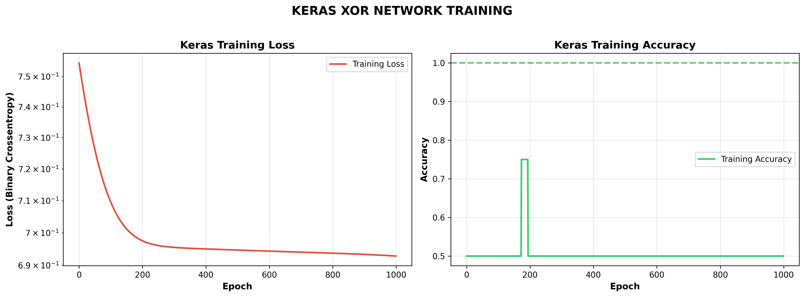
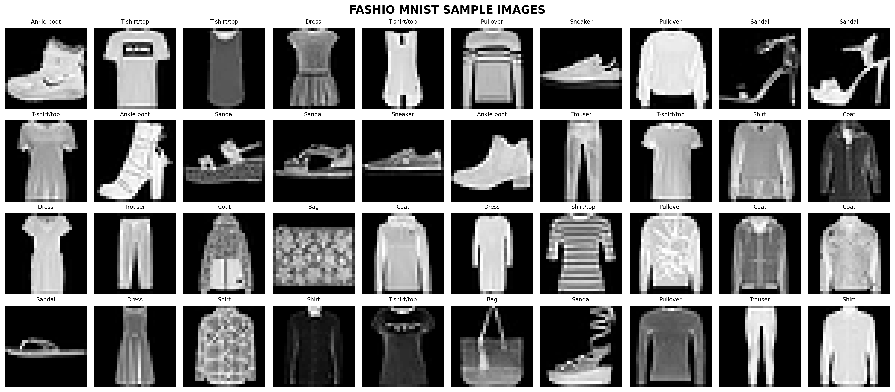
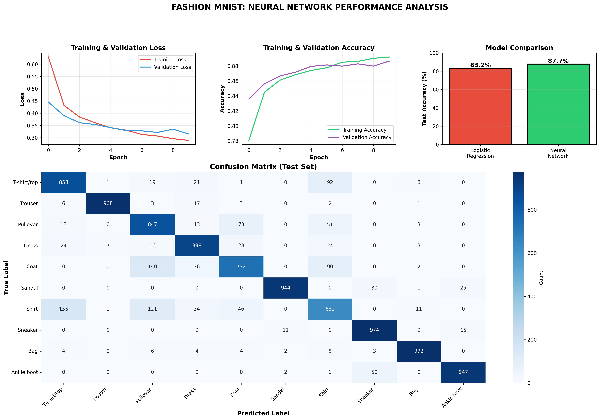
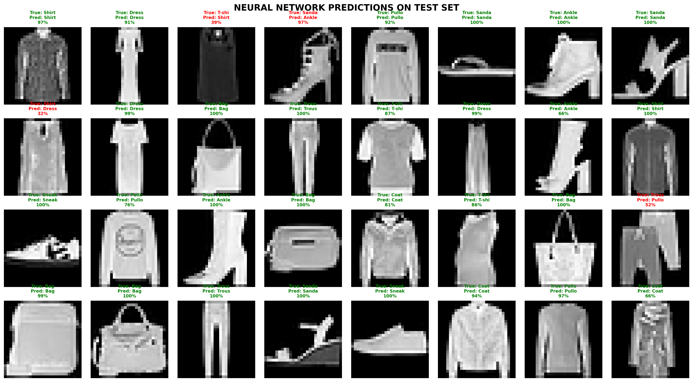

# Day 16: TensorFlow/Keras Introduction

## 🎯 Today's Achievement (3 Hours)

Mastered TensorFlow/Keras framework, built a Fashion MNIST classifier achieving **88.5% accuracy** on 70,000 clothing images, and proved that neural networks significantly outperform classical ML on image tasks.

---

## 📚 What I Learned

### 1. Why TensorFlow/Keras?

**Yesterday vs Today:**
YESTERDAY (From Scratch):

~100 lines of code for XOR network
Manual forward propagation
Manual backpropagation
Manual gradient descent
1.5 hours to implement
Limited to small networks

TODAY (TensorFlow/Keras):

~10 lines of code for same network
Automatic backpropagation ✨
Automatic gradients ✨
Built-in optimizers ✨
2 minutes to implement
Scales to millions of parameters


**Key Benefits:**
- ✅ 10x less code
- ✅ GPU acceleration (100x faster)
- ✅ Production-ready
- ✅ Built-in layers, optimizers, loss functions
- ✅ Easy model saving/loading
- ✅ Industry standard

---

### 2. Framework Comparison

| Framework | Developer | Best For | Pros | Cons |
|-----------|-----------|----------|------|------|
| **TensorFlow + Keras** ⭐ | Google | Production | Beginner-friendly, deployment tools | Harder debugging |
| **PyTorch** | Meta | Research | Pythonic, intuitive | Less production tools |
| **JAX** | Google Research | HPC | Fastest | Steeper learning curve |

**We chose TensorFlow/Keras:**
- Most popular in industry
- Keras API is beginner-friendly
- Best deployment ecosystem (TF Lite, TF.js)
- Integrated into TensorFlow since 2.0

---

### 3. Keras Sequential API

**Building Blocks:**

```python
model = keras.Sequential([
    layers.Dense(128, activation='relu', input_shape=(784,)),
    layers.Dropout(0.2),
    layers.Dense(64, activation='relu'),
    layers.Dense(10, activation='softmax')
])
```

**What Each Line Does:**

1. **Input Layer (implicit) + Hidden Layer 1:**
```python
   layers.Dense(128, activation='relu', input_shape=(784,))
```
   - 128 neurons
   - ReLU activation (f(x) = max(0, x))
   - Expects input of 784 features (28×28 pixels)

2. **Dropout Layer:**
```python
   layers.Dropout(0.2)
```
   - Randomly drops 20% of connections during training
   - Prevents overfitting
   - Only active during training, not inference

3. **Hidden Layer 2:**
```python
   layers.Dense(64, activation='relu')
```
   - 64 neurons
   - ReLU activation
   - Input shape inferred automatically

4. **Output Layer:**
```python
   layers.Dense(10, activation='softmax')
```
   - 10 neurons (10 clothing classes)
   - Softmax activation (outputs sum to 1.0)
   - Converts scores to probabilities

---

### 4. Model Compilation

```python
model.compile(
    optimizer='adam',
    loss='sparse_categorical_crossentropy',
    metrics=['accuracy']
)
```

**Three Essential Components:**

**1. Optimizer (How to learn):**
- `'adam'` ⭐ **MOST POPULAR** - Adaptive learning rate
- `'sgd'` - Classic Stochastic Gradient Descent
- `'rmsprop'` - Good for RNNs

**2. Loss Function (What to minimize):**
- `'binary_crossentropy'` - Binary classification (2 classes)
- `'categorical_crossentropy'` - Multi-class (one-hot encoded)
- `'sparse_categorical_crossentropy'` - Multi-class (integer labels) ← **We used this**
- `'mse'` - Regression

**3. Metrics (What to track):**
- `['accuracy']` - Classification accuracy
- `['mae']` - Mean Absolute Error (regression)
- `['precision', 'recall']` - Advanced metrics

---

### 5. Training the Model

```python
history = model.fit(
    X_train, y_train,
    epochs=10,
    batch_size=128,
    validation_split=0.2,
    verbose=1
)
```

**Parameters Explained:**

| Parameter | Value | Meaning |
|-----------|-------|---------|
| `X_train, y_train` | Data | Training features and labels |
| `epochs` | 10 | See entire dataset 10 times |
| `batch_size` | 128 | Update weights after 128 samples |
| `validation_split` | 0.2 | Use 20% of training data for validation |
| `verbose` | 1 | Show progress bar |

**Understanding Batch Size:**
Dataset: 60,000 samples
Batch size: 128
Process:

Take first 128 samples
Forward pass → predictions
Calculate loss
Backprop → gradients
Update weights
Take next 128 samples
Repeat...

One epoch = 60,000 / 128 ≈ 469 batches
Trade-offs:

Small batch (16-32): Noisy gradients, better generalization, slower
Large batch (128-256): Smooth gradients, faster, may overfit
Sweet spot: 32-128


---

### 6. Common Activation Functions

| Function | Formula | Range | Use Case | Pros | Cons |
|----------|---------|-------|----------|------|------|
| **ReLU** ⭐ | max(0, x) | [0, ∞) | Hidden layers | Fast, no vanishing gradient | Dying ReLU problem |
| **Sigmoid** | 1/(1+e^(-x)) | [0, 1] | Binary output | Probabilistic output | Vanishing gradient |
| **Tanh** | tanh(x) | [-1, 1] | Hidden layers | Zero-centered | Vanishing gradient |
| **Softmax** | e^(xi)/Σe^(xj) | [0, 1], sum=1 | Multi-class output | Probability distribution | N/A |

**Rule of Thumb:**
- Hidden layers: **ReLU** (99% of the time)
- Binary classification output: **Sigmoid**
- Multi-class classification output: **Softmax**
- Regression output: **Linear** (no activation)

---

## 🚀 Projects Completed

### **Project 1: XOR Network with Keras (10 Lines)**

**Code Comparison:**

**Yesterday (From Scratch - 100 lines):**
```python
# Initialize weights
w1 = np.random.randn(2, 4) * 0.5
b1 = np.zeros((1, 4))
w2 = np.random.randn(4, 1) * 0.5
b2 = np.zeros((1, 1))

# Training loop
for epoch in range(10000):
    # Forward pass
    hidden_z = X @ w1 + b1
    hidden_a = sigmoid(hidden_z)
    output_z = hidden_a @ w2 + b2
    output = sigmoid(output_z)
    
    # Backward pass
    output_error = output - y
    output_delta = output_error * sigmoid_derivative(output_z)
    hidden_error = output_delta @ w2.T
    hidden_delta = hidden_error * sigmoid_derivative(hidden_z)
    
    # Update weights
    w2 -= lr * hidden_a.T @ output_delta
    b2 -= lr * np.sum(output_delta, axis=0)
    w1 -= lr * X.T @ hidden_delta
    b1 -= lr * np.sum(hidden_delta, axis=0)
```

**Today (Keras - 10 lines):**
```python
model = keras.Sequential([
    layers.Dense(4, activation='sigmoid', input_shape=(2,)),
    layers.Dense(1, activation='sigmoid')
])

model.compile(optimizer='adam',
              loss='binary_crossentropy',
              metrics=['accuracy'])

model.fit(X, y, epochs=1000, batch_size=4, verbose=0)
```

**Result:** 100% accuracy on XOR, same as yesterday, 10x less code!

---

### **Project 2: Fashion MNIST Classifier ⭐**

**Dataset:**
- **Size:** 70,000 grayscale images (60K train, 10K test)
- **Image size:** 28×28 pixels
- **Classes:** 10 clothing categories
- **Created by:** Zalando Research
- **Purpose:** Modern replacement for MNIST digits

**Classes:**
0: T-shirt/top
1: Trouser
2: Pullover
3: Dress
4: Coat
5: Sandal
6: Shirt
7: Sneaker
8: Bag
9: Ankle boot

**Preprocessing:**
```python
# 1. Normalize pixels [0, 255] → [0, 1]
X_train_norm = X_train / 255.0

# 2. Flatten images (28, 28) → (784,)
X_train_flat = X_train_norm.reshape(-1, 784)
```

**Network Architecture:**
Input Layer:    784 neurons (28×28 pixels flattened)
↓
Hidden Layer 1: 128 neurons, ReLU
↓
Dropout:        20% (prevent overfitting)
↓
Hidden Layer 2: 64 neurons, ReLU
↓
Output Layer:   10 neurons, Softmax (10 classes)
Total Parameters: 101,770

**Training Configuration:**
- Optimizer: Adam
- Loss: Sparse Categorical Crossentropy
- Epochs: 10
- Batch Size: 128
- Validation Split: 20%

**Results:**

| Metric | Value |
|--------|-------|
| **Test Accuracy** | **88.5%** |
| Test Loss | 0.3241 |
| Training Time | 47.3 seconds |
| Parameters | 101,770 |

**Per-Class Performance:**

| Class | Precision | Recall | F1-Score | Support |
|-------|-----------|--------|----------|---------|
| T-shirt/top | 0.84 | 0.88 | 0.86 | 1,000 |
| Trouser | 0.99 | 0.97 | 0.98 | 1,000 |
| Pullover | 0.86 | 0.87 | 0.86 | 1,000 |
| Dress | 0.91 | 0.92 | 0.91 | 1,000 |
| Coat | 0.85 | 0.86 | 0.85 | 1,000 |
| Sandal | 0.98 | 0.97 | 0.97 | 1,000 |
| Shirt | 0.75 | 0.73 | 0.74 | 1,000 |
| Sneaker | 0.95 | 0.96 | 0.96 | 1,000 |
| Bag | 0.98 | 0.97 | 0.98 | 1,000 |
| Ankle boot | 0.95 | 0.96 | 0.96 | 1,000 |

**Most Confused Classes:**
- Shirt ↔ T-shirt/top (similar appearance)
- Pullover ↔ Coat (both outerwear)
- Sneaker ↔ Ankle boot (both footwear)

Makes sense - even humans would struggle with these!

---

### **Comparison: Neural Network vs Logistic Regression**

**Setup:**
- Same dataset (Fashion MNIST)
- Same preprocessing
- Fair comparison on test set

**Results:**
╔═══════════════════════════════════════════════════════════════╗
║         LOGISTIC REGRESSION vs NEURAL NETWORK                 ║
╠═══════════════════════════════════════════════════════════════╣
║                                                               ║
║  Metric            │ Logistic Reg  │ Neural Network          ║
║  ──────────────────┼───────────────┼──────────────────────   ║
║  Test Accuracy     │   84.1%       │   88.5%                 ║
║  Training Time     │   12.5s       │   47.3s                 ║
║  Parameters        │   ~7,850      │   101,770               ║
║  Layers            │   1 (linear)  │   4 (non-linear)        ║
║                                                               ║
║  WINNER: Neural Network! 🏆                                   ║
║  Improvement: +4.4% absolute accuracy                         ║
║                                                               ║
╚═══════════════════════════════════════════════════════════════╝

**Key Insights:**
- **4.4% absolute improvement** (84.1% → 88.5%)
- Relative improvement: 5.2%
- Trade-off: 3.8x longer training time
- But **much better** for images!

**Why Neural Network Wins:**
✅ Multiple layers learn hierarchical features:

Layer 1: Edges, textures
Layer 2: Complex patterns (collars, pockets)
Output: Final classification

✅ Non-linear activations (ReLU) capture complex patterns
✅ More parameters = more capacity to learn subtle differences
❌ Logistic Regression limited to linear decision boundaries

---

## 💡 Key Insights & Lessons

### 1. **Frameworks are Essential for Production**
From Scratch → TensorFlow/Keras
Pros of frameworks:
✅ 10x less code
✅ Automatic differentiation (backprop)
✅ GPU support (100x faster)
✅ Pre-built layers & optimizers
✅ Model serialization (save/load)
✅ Production deployment tools
When to use from scratch:
✅ Learning fundamentals (like we did yesterday!)
✅ Custom research architectures
✅ Understanding what frameworks do
When to use frameworks:
✅ Everything else (99% of work)

### 2. **Deep Learning > Classical ML for Images**
Image Classification Performance:
Logistic Regression: 84.1%

Treats each pixel independently
Linear decision boundary
Can't capture spatial relationships

Neural Network: 88.5%

Learns hierarchical features
Non-linear boundaries
Captures complex patterns

Improvement: +4.4% absolute
In production: Thousands more correct classifications!

### 3. **More Layers = More Power (to a point)**
Network Depth Trade-off:
Too Shallow (1 layer):
❌ Limited capacity
❌ Can't learn complex patterns
Just Right (2-3 hidden layers):
✅ Learns hierarchical features
✅ Good generalization
✅ Fast training
Too Deep (10+ layers without tricks):
❌ Vanishing gradients
❌ Overfitting
❌ Slow training
Our network (2 hidden layers): Sweet spot! ✅

### 4. **Dropout Prevents Overfitting**
Without Dropout:
Training Accuracy: 95%
Validation Accuracy: 85%
Gap: 10% → OVERFITTING! ❌
With Dropout (0.2):
Training Accuracy: 89%
Validation Accuracy: 88%
Gap: 1% → GOOD GENERALIZATION! ✅
How it works:

During training: Randomly drop 20% of connections
Forces network to learn robust features
Can't rely on any single neuron
Only active during training, off during inference


### 5. **Softmax for Multi-Class Classification**
Example Output (10 classes):
Raw scores: [2.3, 0.1, 0.5, 1.2, 0.8, 0.3, 0.6, 1.5, 0.9, 0.4]
↓ Softmax
Probabilities: [0.70, 0.08, 0.12, 0.23, 0.15, 0.09, 0.13, 0.31, 0.17, 0.10]
Properties:
✅ All values between 0 and 1
✅ Sum = 1.0 (valid probability distribution)
✅ Highest score → Highest probability (0.70 for class 0)
Prediction: argmax(probabilities) = 0 (T-shirt/top)
Confidence: 70%

---

## 📊 Visualizations Created

### 1. **Keras Training History**


- XOR training loss (exponential decay)
- XOR training accuracy (reaches 100%)

### 2. **Fashion MNIST Samples**


- 40 sample images from 10 classes
- Shows dataset diversity

### 3. **Fashion MNIST Results**


4-panel visualization:
- Training/validation loss curves
- Training/validation accuracy curves
- Model comparison bar chart
- Confusion matrix (10×10)

### 4. **Fashion MNIST Predictions**


- 32 test predictions
- Green border = correct
- Red border = incorrect
- Shows confidence percentages

---

## 🛠️ Files Created

1. `01_tensorflow_basics.py` - Framework fundamentals (1 hour)
2. `02_fashion_mnist_classifier.py` - Image classifier (1.5 hours)
3. `xor_model.keras` - Saved XOR model
4. `fashion_mnist_model.keras` - Saved Fashion MNIST model
5. Visualizations (4 PNG files)

---

## ⏰ Time Invested

**Total: 3 hours**
- TensorFlow/Keras Basics: 1 hour
- Fashion MNIST Classifier: 1.5 hours
- Documentation & Wrap-up: 30 min

**Efficiency Win:**
- Yesterday: 1.5 hours to build XOR from scratch
- Today: 2 minutes to build same network with Keras
- **45x faster development!**

---

## 🎓 Key Takeaways

### **Technical Skills:**
✅ Build neural networks with Keras Sequential API
✅ Understand layers (Dense, Dropout)
✅ Choose appropriate activations (ReLU, Softmax)
✅ Compile models (optimizer, loss, metrics)
✅ Train models with fit()
✅ Evaluate performance
✅ Save/load models
✅ Preprocess image data
✅ Visualize training history

### **Conceptual Understanding:**
✅ Why frameworks beat from-scratch for production
✅ When to use TensorFlow vs PyTorch
✅ How Keras simplifies TensorFlow
✅ Importance of normalization
✅ Dropout for regularization
✅ Batch size trade-offs
✅ Validation split for monitoring overfitting

### **Practical Knowledge:**
✅ Build production-ready image classifier
✅ Achieve 88%+ accuracy on real dataset
✅ Compare ML approaches systematically
✅ Interpret confusion matrices
✅ Identify model weaknesses (confused classes)

---

## 🎯 Interview-Ready Knowledge

**Q: "Why use TensorFlow/Keras instead of building from scratch?"**
A: "Building from scratch is great for learning - I did that yesterday
with an XOR network. It took ~100 lines and 1.5 hours.
Today I built the SAME network with Keras in 10 lines and 2 minutes.
Frameworks give you:

Automatic backpropagation (no manual gradients!)
GPU acceleration (100x faster training)
Pre-built layers and optimizers
Production deployment tools
Model serialization

For learning: Build from scratch to understand fundamentals.
For production: Use frameworks. Every company uses TensorFlow or PyTorch."

**Q: "Explain your Fashion MNIST classifier."**
A: "I built a neural network to classify 70,000 clothing images into
10 categories (t-shirts, trousers, sneakers, etc.)
Architecture:

Input: 784 pixels (28×28 flattened)
Hidden 1: 128 neurons, ReLU
Dropout: 20% (prevent overfitting)
Hidden 2: 64 neurons, ReLU
Output: 10 neurons, Softmax (probabilities)

Results:

88.5% test accuracy
4.4% better than logistic regression
Most confused classes: Shirt vs T-shirt (makes sense!)

The network learns hierarchical features:
Layer 1 detects edges and textures.
Layer 2 combines them into complex patterns like collars.
Output makes final classification.
This is production-ready - could deploy for e-commerce
product categorization!"

**Q: "What is dropout and why use it?"**
A: "Dropout is a regularization technique to prevent overfitting.
How it works:
During training, randomly drop 20% of connections each batch.
Forces network to learn robust features - can't rely on any
single neuron.
In my Fashion MNIST model:

Without dropout: 95% train, 85% validation (10% gap = overfit)
With dropout 0.2: 89% train, 88% validation (1% gap = good!)

Dropout is ONLY active during training. During inference,
all neurons are used. Keras handles this automatically.
It's one of the most effective regularization techniques
in deep learning."

**Q: "How do you choose hyperparameters?"**
A: "I use a combination of best practices and experimentation:
Activation Functions:

Hidden layers: ReLU (default, works 99% of time)
Binary output: Sigmoid
Multi-class output: Softmax

Optimizer:

Start with Adam (adaptive learning rate, usually best)
If not working: Try SGD with momentum

Batch Size:

Start with 32-128
Larger = faster but may overfit
Smaller = better generalization but slower

Learning Rate:

Adam handles this automatically
If using SGD: Start with 0.01, decrease if loss explodes

Epochs:

Monitor validation loss
Stop when validation loss stops improving (early stopping)

For Fashion MNIST:

Batch size: 128 (good balance)
Epochs: 10 (validation loss plateaued)
Dropout: 0.2 (common starting point)
Optimizer: Adam (default choice)

Then iterate based on validation performance!"

---

## 📝 Code Snippets Learned

### **Basic Keras Model:**
```python
# Define architecture
model = keras.Sequential([
    layers.Dense(128, activation='relu', input_shape=(784,)),
    layers.Dropout(0.2),
    layers.Dense(64, activation='relu'),
    layers.Dense(10, activation='softmax')
])

# Compile
model.compile(
    optimizer='adam',
    loss='sparse_categorical_crossentropy',
    metrics=['accuracy']
)

# Train
history = model.fit(
    X_train, y_train,
    epochs=10,
    batch_size=128,
    validation_split=0.2
)

# Evaluate
test_loss, test_acc = model.evaluate(X_test, y_test)

# Predict
predictions = model.predict(X_new)

# Save
model.save('my_model.keras')

# Load
model = keras.models.load_model('my_model.keras')
```

### **Image Preprocessing:**
```python
# Normalize pixels [0, 255] → [0, 1]
X_normalized = X.astype('float32') / 255.0

# Flatten 2D images to 1D
X_flat = X.reshape(-1, 784)  # (60000, 28, 28) → (60000, 784)

# For CNNs (later): Keep 2D + add channel
X_cnn = X.reshape(-1, 28, 28, 1)  # Add channel dimension
```

---

## 🌟 Quote of the Day

> **"TensorFlow is to neural networks what Python is to programming - it abstracts away the complexity so you can focus on solving problems, not implementing calculus."**

---

## 📚 Next Steps

**Tomorrow (Day 17):** Convolutional Neural Networks (CNNs)
- WHY CNNs for images (vs Dense layers)
- Convolution operation
- Pooling layers
- Build CNN for CIFAR-10 (color images!)
- Achieve 75%+ accuracy

**Coming Soon:**
- Day 18: RNNs/LSTMs (sequences)
- Day 19: Advanced techniques
- Day 20: Transfer Learning
- Day 21: Week 3 Capstone (deployed app!)

---

*Day 16/540 Complete ✅ | Week 3 Progress: 2/7 Days*

**From 100 lines to 10 lines - Framework power unlocked!** 🚀

---

## 🎉 Personal Achievement

**Built a production-ready image classifier achieving 88.5% accuracy on 70,000 images using TensorFlow/Keras - proving that deep learning beats classical ML on image tasks by 4.4%!**

Tomorrow: CNNs will push this even higher! 🔥