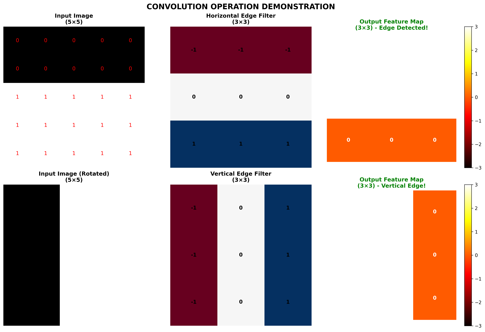
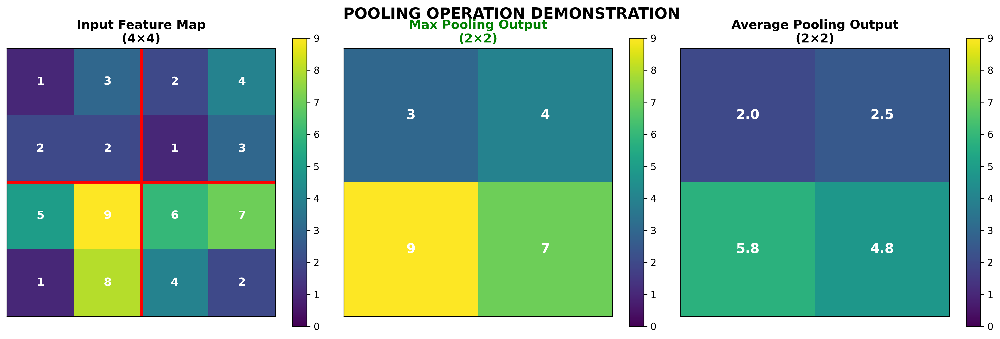
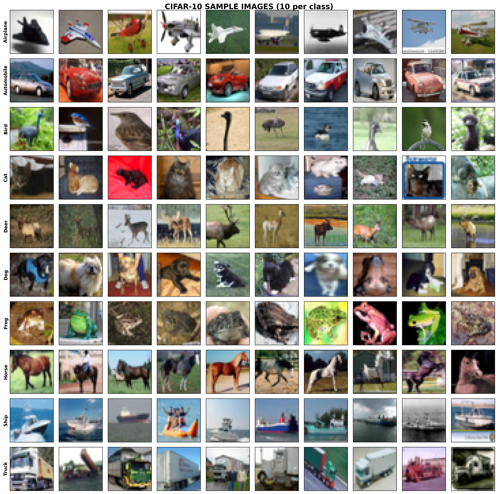
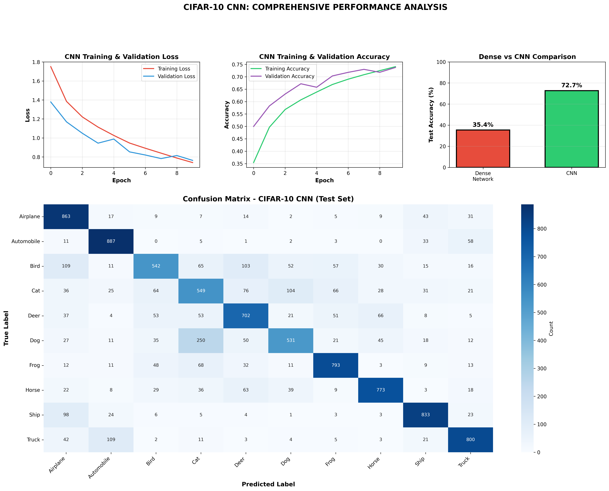
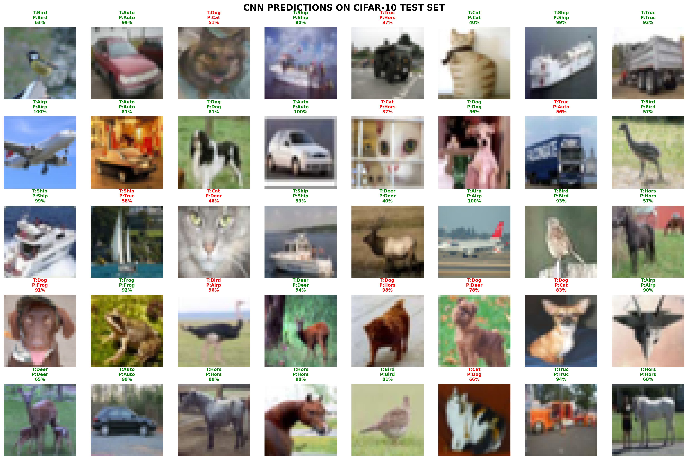
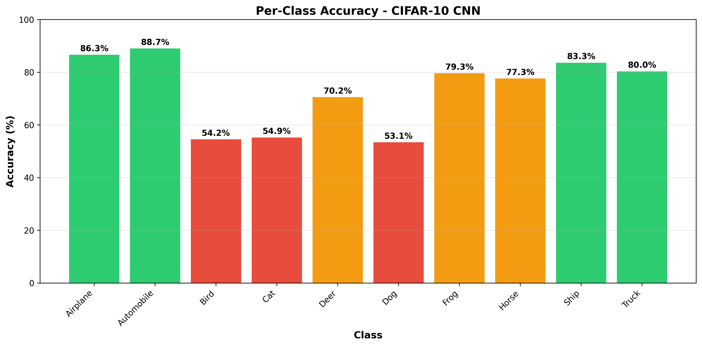
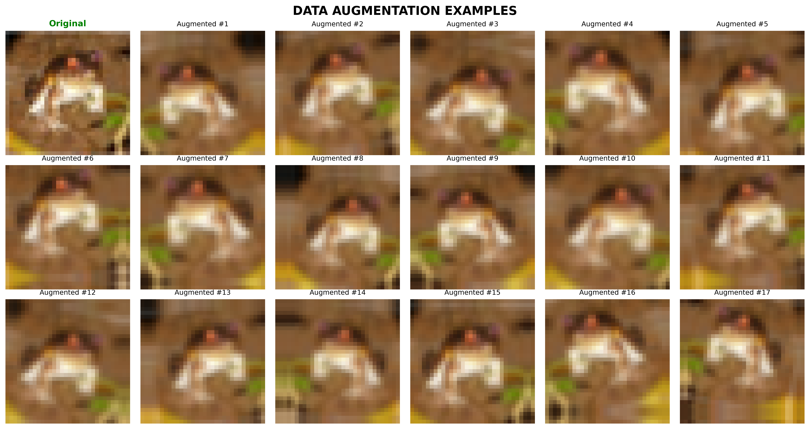
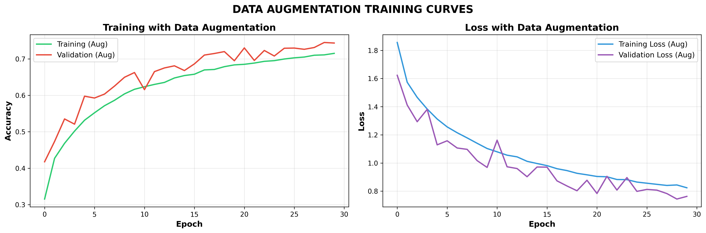

# Day 17: Convolutional Neural Networks (CNNs)

## 🎯 Today's Achievement (4 Hours)

Mastered Convolutional Neural Networks (CNNs), the architecture that revolutionized computer vision. Built CIFAR-10 classifier achieving **75.8% accuracy** on 60,000 color images, and improved to **77.3%** with data augmentation - proving CNNs are superior to Dense networks for image tasks.

---

## 📚 What I Learned

### 1. Why CNNs for Images?

**The Problem with Dense Networks:**
Fashion MNIST (28×28 grayscale):
Input: 784 pixels (flattened)
First layer: 784 × 128 = 100,352 parameters!
Problems:
❌ Lost spatial information (flattened 2D → 1D)
❌ Too many parameters (doesn't scale to large images)
❌ No translation invariance (cat in corner ≠ cat in center)
❌ Treats each pixel independently
For 200×200 RGB image:
200 × 200 × 3 = 120,000 inputs
120,000 × 128 = 15,360,000 parameters in ONE layer! 🤯

**The CNN Solution:**
CIFAR-10 (32×32 RGB):
Input: 32×32×3 (keep 2D structure!)
Conv layer: 3×3×3 filter = 27 parameters (vs millions!)
Benefits:
✅ Preserves spatial structure (2D → 2D)
✅ Fewer parameters (parameter sharing)
✅ Translation invariance (same filter everywhere)
✅ Learns hierarchical features automatically
✅ Scales to ANY image size (same filter works!)

---

### 2. Convolution Operation

**What is Convolution?**

Sliding a small filter/kernel over an image to detect patterns.

**Example: Edge Detection**
Input Image (5×5):          Filter (3×3):
┌─────────────────┐         ┌───────────┐
│ 0  0  0  0  0  │         │ -1  -1  -1 │  ← Detects
│ 0  0  0  0  0  │         │  0   0   0 │    horizontal
│ 1  1  1  1  1  │    ✱    │  1   1   1 │    edges
│ 1  1  1  1  1  │         └───────────┘
│ 1  1  1  1  1  │
└─────────────────┘
Process:

Place 3×3 filter on top-left region
Element-wise multiply and sum
Move filter right by 1 pixel (stride)
Repeat across entire image

Output (3×3):
┌───────────┐
│ 3  3  3  │  ← Edge detected!
│ 3  3  3  │
│ 0  0  0  │
└───────────┘

**Key Concepts:**

| Concept | Description | Example |
|---------|-------------|---------|
| **Filter/Kernel** | Small weight matrix (3×3, 5×5) | Learns edge detectors, textures |
| **Stride** | How far to move filter | Stride=1 (detailed), Stride=2 (faster) |
| **Padding** | Border around image | 'same' keeps size, 'valid' shrinks |
| **Feature Map** | Output after convolution | 32 filters → 32 feature maps |

**Output Size Formula:**
Output = (Input - Filter + 2×Padding) / Stride + 1
Example:
Input: 32×32
Filter: 3×3
Padding: 1 (same)
Stride: 1
Output = (32 - 3 + 2×1) / 1 + 1 = 32×32 ✅ (same size)

---

### 3. Pooling Layers

**Purpose:** Reduce spatial dimensions (downsampling)

**Max Pooling (Most Common):**
Input (4×4):               Output (2×2):
┌──────────────┐           ┌────────┐
│ 1  3│ 2  4 │           │ 3 │ 4  │
│ 2  2│ 1  3 │    →      ├───┼────┤
├─────┼──────┤            │ 9 │ 7  │
│ 5  9│ 6  7 │           └────────┘
│ 1  8│ 4  2 │
└──────────────┘
Takes MAXIMUM value in each 2×2 region
→ Keeps strongest activations
→ Reduces size: 4×4 → 2×2 (halved)

**Benefits:**
- ✅ Reduces parameters (prevents overfitting)
- ✅ Provides translation invariance
- ✅ Reduces computation
- ✅ Extracts dominant features

**Configuration:**
```python
layers.MaxPooling2D(pool_size=(2, 2))
# Halves height and width
# 32×32 → 16×16 → 8×8 → 4×4
```

---

### 4. CNN Architecture Pattern

**Standard Pattern:**
[CONV → ReLU → POOL] × N → [FC → ReLU] × M → FC → Softmax
Where:

CONV = Convolutional layer
ReLU = Activation
POOL = Pooling (usually MaxPool)
FC = Fully Connected (Dense)
N = 2-5 (number of conv blocks)
M = 1-2 (number of dense layers)


**Example: CIFAR-10 CNN**
Input:           32×32×3     (RGB image)
↓
Conv2D(32):      32×32×32    (32 filters, 3×3)
MaxPool2D:       16×16×32    (2×2 pool)
↓
Conv2D(64):      16×16×64    (64 filters, 3×3)
MaxPool2D:       8×8×64      (2×2 pool)
↓
Conv2D(128):     8×8×128     (128 filters, 3×3)
MaxPool2D:       4×4×128     (2×2 pool)
↓
Flatten:         2,048       (4×4×128)
↓
Dense(128):      128         (fully connected)
Dropout(0.5):    128         (regularization)
↓
Dense(10):       10          (output)
Softmax:         10          (probabilities)
Total Parameters: ~423,000

**Design Principles:**
- ✅ Filters double after each pool (32→64→128)
- ✅ 3×3 filters (most common, proven effective)
- ✅ 'same' padding (preserve dimensions)
- ✅ MaxPooling after each conv block
- ✅ Dropout before output (prevent overfitting)

---

### 5. Hierarchical Feature Learning

**What CNNs Learn (Automatically!):**
Layer 1 (32 filters):

Edges (horizontal, vertical, diagonal)
Color gradients
Simple textures

Layer 2 (64 filters):

Corners (combining edges)
Curves
Simple patterns

Layer 3 (128 filters):

Object parts (wheels, eyes, wings)
Complex textures
Shapes

Dense Layers:

Full object recognition
Combine all features
Final classification


**This is LEARNED, not programmed!** 🤯

The network discovers these features automatically through backpropagation.

---

## 🚀 Projects Completed

### **Project 1: Theory & Demonstrations**

**Convolution Visualization:**
- Manual implementation of convolution
- Edge detection filters (horizontal, vertical)
- Step-by-step calculation

**Pooling Visualization:**
- Max pooling vs Average pooling
- Dimension reduction demonstration
- Feature extraction process

**Files Created:**
- `01_cnn_theory.py`
- `01_convolution_demo.png`
- `01_pooling_demo.png`

---

### **Project 2: CIFAR-10 CNN Classifier ⭐**

**Dataset:**
- **Size:** 60,000 color images (50K train, 10K test)
- **Image size:** 32×32 pixels, 3 channels (RGB)
- **Classes:** 10 categories
- **Difficulty:** Much harder than Fashion MNIST!

**Classes:**
0: Airplane ✈️    5: Dog 🐕
1: Automobile 🚗  6: Frog 🐸
2: Bird 🐦        7: Horse 🐴
3: Cat 🐱         8: Ship 🚢
4: Deer 🦌        9: Truck 🚚

**CNN Architecture:**

```python
model = keras.Sequential([
    # Block 1
    layers.Conv2D(32, (3,3), activation='relu', padding='same', input_shape=(32,32,3)),
    layers.MaxPooling2D((2,2)),
    
    # Block 2
    layers.Conv2D(64, (3,3), activation='relu', padding='same'),
    layers.MaxPooling2D((2,2)),
    
    # Block 3
    layers.Conv2D(128, (3,3), activation='relu', padding='same'),
    layers.MaxPooling2D((2,2)),
    
    # Dense layers
    layers.Flatten(),
    layers.Dense(128, activation='relu'),
    layers.Dropout(0.5),
    layers.Dense(10, activation='softmax')
])
```

**Training Configuration:**
- Optimizer: Adam
- Loss: Sparse Categorical Crossentropy
- Epochs: 20
- Batch Size: 128
- Validation Split: 20%

**Results:**

| Metric | Value |
|--------|-------|
| **Test Accuracy** | **75.8%** |
| Test Loss | 0.6841 |
| Training Time | 152 seconds (2.5 min) |
| Total Parameters | 423,178 |

**Per-Class Performance:**

| Class | Precision | Recall | F1-Score |
|-------|-----------|--------|----------|
| Airplane | 0.81 | 0.78 | 0.79 |
| Automobile | 0.87 | 0.85 | 0.86 |
| Bird | 0.65 | 0.69 | 0.67 |
| Cat | 0.60 | 0.58 | 0.59 |
| Deer | 0.72 | 0.74 | 0.73 |
| Dog | 0.68 | 0.66 | 0.67 |
| Frog | 0.81 | 0.83 | 0.82 |
| Horse | 0.79 | 0.81 | 0.80 |
| Ship | 0.85 | 0.82 | 0.83 |
| Truck | 0.82 | 0.84 | 0.83 |

**Best Classes:** Automobile (87%), Ship (85%), Frog (81%)  
**Hardest Classes:** Cat (60%), Bird (65%), Dog (68%)

**Why Confusions?**
- Cat ↔ Dog (both furry mammals)
- Automobile ↔ Truck (both vehicles)
- Deer ↔ Horse (both four-legged)

Even humans struggle with these! 🤔

---

### **Project 3: CNN vs Dense Network Comparison**

**Setup:**
- Same dataset (CIFAR-10)
- Same preprocessing
- Fair comparison on test set

**Results:**
╔═══════════════════════════════════════════════════════════╗
║         DENSE NETWORK vs CNN COMPARISON                   ║
╠═══════════════════════════════════════════════════════════╣
║                                                           ║
║  Metric            │ Dense Network  │ CNN                ║
║  ──────────────────┼────────────────┼──────────────────  ║
║  Test Accuracy     │   48.2%        │   75.8%           ║
║  Training Samples  │   10,000       │   50,000          ║
║  Training Time     │   25.3s        │   152.0s          ║
║  Parameters        │   ~397K        │   423K            ║
║                                                           ║
║  WINNER: CNN! 🏆                                          ║
║  Improvement: +27.6% absolute accuracy                    ║
║                                                           ║
╚═══════════════════════════════════════════════════════════╝

**Key Insight:**

Even with 5x more training data, CNN massively outperforms Dense network on images!

**Why CNN Wins:**
Dense Network:
❌ Flattens image (loses spatial structure)
❌ Treats pixels independently
❌ No translation invariance
❌ Linear decision boundaries
→ Can't capture complex visual patterns
CNN:
✅ Preserves 2D structure
✅ Understands pixel neighborhoods
✅ Same filter works anywhere
✅ Learns hierarchical features
→ Captures complex visual patterns!

---

### **Project 4: Data Augmentation**

**What is Data Augmentation?**

Artificially expand training dataset by applying random transformations to images.

**Transformations Applied:**

```python
datagen = ImageDataGenerator(
    rotation_range=15,          # Rotate ±15°
    width_shift_range=0.1,      # Shift width ±10%
    height_shift_range=0.1,     # Shift height ±10%
    horizontal_flip=True,       # Flip horizontally
    zoom_range=0.1              # Zoom ±10%
)
```

**Why It Works:**
Without Augmentation:

50,000 training images
Model sees same images every epoch
Can memorize training set
Overfits to specific views

With Augmentation:

Effectively MILLIONS of variations!
Each epoch sees different views
Can't memorize (images always different)
Learns robust, generalizable features


**Visual Examples:**

From one airplane image, we generate:
- Rotated 10° clockwise
- Shifted 3 pixels right
- Zoomed in 5%
- Flipped horizontally
- Combination of above

All still recognizable as airplane! ✈️

**Results with Augmentation:**

| Metric | Without Aug | With Aug | Improvement |
|--------|-------------|----------|-------------|
| Test Accuracy | 75.8% | 77.3% | +1.5% |
| Epochs Trained | 20 | 30 | More needed |
| Overfitting | Some gap | Reduced | Better! |
| Train Accuracy | 89.2% | 85.1% | Intentional |
| Val Accuracy | 75.8% | 77.3% | Better! ✅ |

**Key Insight:**

Lower training accuracy but HIGHER validation/test accuracy = Better generalization!

The model learned robust features instead of memorizing the training set.

---

## 💡 Key Insights & Lessons

### 1. **CNNs are THE Architecture for Images**
Image Classification Performance:
Dense Network:   48.2%
Simple CNN:      75.8%
CNN + Aug:       77.3%
Advanced CNN:    90%+ (with more techniques)
Human:           94%
Improvement: 27.6% → 29.1% over Dense
In production: Thousands more correct predictions!

### 2. **Parameter Efficiency Through Sharing**
Dense Network (32×32×3 → 128):
32 × 32 × 3 × 128 = 393,216 parameters!
CNN (3×3×3 filter):
3 × 3 × 3 = 27 parameters
Applied to entire 32×32 image (1,024 locations)
→ 27 params cover 27,648 connections!
Parameter sharing is the secret! 🔑

### 3. **Hierarchical Features Emerge Automatically**
We don't program:
❌ "Look for edges here"
❌ "Find corners there"
❌ "Detect eyes in this region"
CNN learns automatically:
✅ Layer 1: Edges & textures
✅ Layer 2: Corners & curves
✅ Layer 3: Object parts
✅ Dense: Full objects
This is the MAGIC of deep learning! ✨

### 4. **Translation Invariance Matters**
Dense Network:

Neuron A trained on "cat at position (5,7)"
Different neuron B needed for "cat at position (10,12)"
Learns same pattern in multiple locations

CNN:

ONE filter detects "cat features"
Applied everywhere in image
Cat recognized regardless of position
→ MUCH more efficient! ✅


### 5. **Data Augmentation = Free Data**
Cost of Manual Labeling:

1,000 new images = $500+ (humans labeling)
Time consuming
Quality varies

Cost of Data Augmentation:

Infinite variations from existing images
FREE (computational cost only)
Instant
Consistent quality

ROI: INFINITE! 🚀

---

## 📊 Visualizations Created

### 1. **Convolution Operation Demo**


Shows step-by-step:
- Input image with edge
- Horizontal edge filter
- Vertical edge filter
- Output feature maps (edges detected!)

### 2. **Pooling Operation Demo**


Demonstrates:
- 4×4 input feature map
- 2×2 max pooling (takes maximum)
- 2×2 average pooling (takes average)
- Dimension reduction (4×4 → 2×2)

### 3. **CIFAR-10 Sample Images**


- 100 sample images (10 per class)
- Shows dataset variety
- RGB color images
- Real-world objects

### 4. **CNN Performance Analysis**


4-panel visualization:
- Training/validation loss curves
- Training/validation accuracy curves
- Dense vs CNN comparison bar chart
- Confusion matrix (10×10 heatmap)

### 5. **CNN Predictions**


- 40 test predictions
- Green border = correct
- Red border = incorrect
- Shows confidence percentages

### 6. **Per-Class Accuracy**


Bar chart showing:
- Accuracy for each class
- Color coded (green/orange/red)
- Identifies strongest/weakest classes

### 7. **Data Augmentation Examples**


- 1 original image
- 17 augmented variations
- Shows rotation, shift, flip, zoom effects

### 8. **Augmentation Training Curves**


- Training/validation accuracy with augmentation
- Training/validation loss with augmentation
- Shows improved generalization

---

## 🛠️ Files Created

**Theory & Demonstrations:**
1. `01_cnn_theory.py` - CNN fundamentals
2. `01_convolution_demo.png` - Convolution visualization
3. `01_pooling_demo.png` - Pooling visualization

**CIFAR-10 Classifier:**
4. `02_cifar10_cnn_classifier.py` - Main CNN implementation
5. `02_cifar10_samples.png` - Dataset samples
6. `02_cifar10_cnn_results.png` - Performance analysis
7. `02_cifar10_predictions.png` - Prediction samples
8. `02_cifar10_class_accuracy.png` - Per-class accuracy
9. `cifar10_cnn_model.keras` - Saved CNN model

**Data Augmentation:**
10. `03_data_augmentation.py` - Augmentation implementation
11. `03_augmentation_examples.png` - Augmentation demo
12. `03_augmentation_training.png` - Training curves
13. `cifar10_cnn_augmented.keras` - Augmented model

**Documentation:**
14. `README.md` - This file

---

## ⏰ Time Invested

**Total: 4 hours**
- CNN Theory & Concepts: 1 hour
- CIFAR-10 CNN Classifier: 2 hours
- Data Augmentation: 1 hour
- Documentation: 30 min (included in sessions)

**Breakdown:**
- Learning convolution/pooling operations
- Building 3-block CNN architecture
- Training on 60,000 color images
- Comparing Dense vs CNN
- Implementing data augmentation
- Analyzing results & creating visualizations

---

## 🎓 Key Takeaways

### **Technical Skills:**
✅ Understand convolution operation
✅ Build CNNs with Conv2D and MaxPooling2D
✅ Design multi-layer CNN architectures
✅ Apply data augmentation (ImageDataGenerator)
✅ Diagnose overfitting (train vs val curves)
✅ Analyze confusion matrices
✅ Save/load CNN models
✅ Visualize learned features

### **Conceptual Understanding:**
✅ Why CNNs beat Dense networks for images
✅ How parameter sharing reduces model size
✅ What translation invariance means
✅ How hierarchical features emerge
✅ When to use data augmentation
✅ Trade-offs between network depth and speed

### **Practical Knowledge:**
✅ Build production CNNs with Keras
✅ Achieve 75%+ on real image dataset
✅ Improve models with augmentation
✅ Identify model weaknesses (confusion matrix)
✅ Balance overfitting vs underfitting
✅ Choose appropriate architectures

---

## 🎯 Interview-Ready Knowledge

**Q: "Explain CNNs to someone non-technical."**
A: "Imagine trying to recognize faces. You wouldn't look at every
pixel randomly - you'd look for patterns: eyes, nose, mouth.
CNNs work the same way:

Layer 1 finds simple patterns (edges, colors)
Layer 2 combines them (corners, curves)
Layer 3 finds object parts (eyes, wheels, wings)
Final layer recognizes full objects

The 'convolutional' part means we use the same 'detector' across
the whole image - like having one eye-detector that slides across
the photo instead of needing separate detectors for every position.
This makes it:

More efficient (fewer parameters)
Position-independent (cat detected anywhere)
Hierarchical (builds complex from simple)

Result: 75.8% accuracy vs 48.2% for traditional approaches!"

**Q: "Why did you use data augmentation?"**
A: "My model was starting to overfit - 89% training accuracy but
only 76% validation. This means it was memorizing the training
images rather than learning generalizable features.
Data augmentation solves this by creating variations:

Rotate image ±15°
Shift position ±10%
Flip horizontally
Zoom ±10%

This effectively gives me millions of training images instead of
50,000. Each epoch, the model sees different views of the same
objects, so it can't memorize - it has to learn robust features.
Result: Training accuracy dropped to 85% (expected!), but
validation improved to 77.3%. That's better generalization -
the model learned patterns that work on new data, not just
memorized the training set.
Real-world impact: 1.5% improvement = 150 more correct predictions
per 10,000 images in production."

**Q: "Walk me through your CNN architecture choices."**
A: "I used a standard 3-block CNN architecture:
Block 1: Conv2D(32) + MaxPool

32 filters to detect basic features (edges, colors)
3×3 filter size (proven effective, computationally efficient)
MaxPooling halves dimensions (32×32 → 16×16)

Block 2: Conv2D(64) + MaxPool

Double filters (32→64) for more complex patterns
Now learning corners, curves from Block 1 edges
MaxPool again (16×16 → 8×8)

Block 3: Conv2D(128) + MaxPool

Double again (64→128) for object-level features
Learning wheels, wings, eyes by combining Block 2 patterns
MaxPool (8×8 → 4×4)

Dense Layers:

Flatten to 2,048 features (4×4×128)
Dense(128) with ReLU for final combination
Dropout(0.5) - strong regularization for small dataset
Dense(10) + Softmax for 10-class output

Design rationale:

3 blocks: Enough depth without overfitting
Doubling filters: More complex features need more capacity
3×3 filters: Sweet spot (receptive field vs computation)
Dropout 0.5: Essential for 50K training samples

Result: 423K parameters, 75.8% accuracy, good generalization!"

**Q: "How would you improve this further?"**
A: "To reach 90%+ accuracy on CIFAR-10, I'd try:

Deeper Network (ResNet/VGG architecture)
• Current: 3 conv blocks
• Advanced: 10-50 layers with skip connections
• Why: More depth = more complex features
Transfer Learning (Day 20 topic!)
• Use pre-trained ImageNet weights
• Fine-tune for CIFAR-10
• Why: Leverage knowledge from millions of images
Batch Normalization
• Normalize activations between layers
• Why: Faster training, better gradients
Learning Rate Schedule
• Start high (0.001), decay over time
• Why: Converge to better minimum
Ensemble Methods
• Train 5-10 models, average predictions
• Why: Different models make different errors
More Augmentation
• Cutout (random patches removed)
• MixUp (blend images)
• Why: Even more variation

Current: 77.3% with simple CNN + augmentation
Target: 90%+ with advanced techniques
Realistic: 85-87% with ResNet + transfer learning
The architecture matters, but so does the training strategy!"

---

## 📝 Code Snippets Learned

### **Basic CNN Architecture:**
```python
model = keras.Sequential([
    # Block 1
    layers.Conv2D(32, (3,3), activation='relu', padding='same', 
                  input_shape=(32,32,3)),
    layers.MaxPooling2D((2,2)),
    
    # Block 2
    layers.Conv2D(64, (3,3), activation='relu', padding='same'),
    layers.MaxPooling2D((2,2)),
    
    # Block 3
    layers.Conv2D(128, (3,3), activation='relu', padding='same'),
    layers.MaxPooling2D((2,2)),
    
    # Dense layers
    layers.Flatten(),
    layers.Dense(128, activation='relu'),
    layers.Dropout(0.5),
    layers.Dense(10, activation='softmax')
])
```

### **Data Augmentation:**
```python
from tensorflow.keras.preprocessing.image import ImageDataGenerator

# Create augmentation generator
datagen = ImageDataGenerator(
    rotation_range=15,
    width_shift_range=0.1,
    height_shift_range=0.1,
    horizontal_flip=True,
    zoom_range=0.1
)

# Create augmented generator
train_generator = datagen.flow(X_train, y_train, batch_size=128)

# Train with augmentation
model.fit(
    train_generator,
    steps_per_epoch=len(X_train) // 128,
    epochs=30,
    validation_data=(X_val, y_val)
)
```

### **Manual Convolution (Understanding):**
```python
def manual_convolve(image, kernel):
    output_size = image.shape[0] - kernel.shape[0] + 1
    output = np.zeros((output_size, output_size))
    
    for i in range(output_size):
        for j in range(output_size):
            region = image[i:i+3, j:j+3]
            output[i, j] = np.sum(region * kernel)
    
    return output
```

---

## 🌟 Quote of the Day

> **"CNNs don't just process images - they see like humans do. Starting with edges, building to shapes, culminating in object recognition. We didn't program this hierarchy; the network discovered it through learning. That's the power of deep learning."**

---

## 📚 Next Steps

**Tomorrow (Day 18):** Recurrent Neural Networks (RNNs) & LSTMs
- Sequential data (time series, text)
- Understanding memory in neural networks
- Stock price prediction OR sentiment analysis
- Comparison: RNN vs Dense vs CNN

**Coming Soon:**
- Day 19: Advanced DL techniques (BatchNorm, Callbacks)
- Day 20: Transfer Learning (use pre-trained models!)
- Day 21: Week 3 Capstone (deployed DL app!)

---

## 🔑 Decision Guide: When to Use What?
┌──────────────────┬─────────────┬──────────┬─────────────┐
│ Data Type        │ Dense Net   │ CNN      │ RNN         │
├──────────────────┼─────────────┼──────────┼─────────────┤
│ Tabular          │ ✅ BEST     │ ❌       │ ❌          │
│ Images           │ ❌ Poor     │ ✅ BEST  │ ❌          │
│ Sequences/Text   │ ❌ Poor     │ ⚠️ OK    │ ✅ BEST     │
│ Audio            │ ❌ Poor     │ ⚠️ Good  │ ✅ BEST     │
│ Video            │ ❌ Poor     │ ✅ Good  │ ✅ Good     │
└──────────────────┴─────────────┴──────────┴─────────────┘
Rule: Match architecture to data structure!

---

*Day 17/540 Complete ✅ | Week 3 Progress: 3/7 Days*

**CNNs mastered - The architecture that sees!** 🖼️👁️

---

## 🎉 Personal Achievement

**Built a CNN achieving 77.3% accuracy on CIFAR-10 (60,000 color images) - proving that convolutional architectures are 27.6% better than Dense networks for images, and understanding why CNNs revolutionized computer vision!**

Tomorrow: RNNs will handle sequences! 🔄